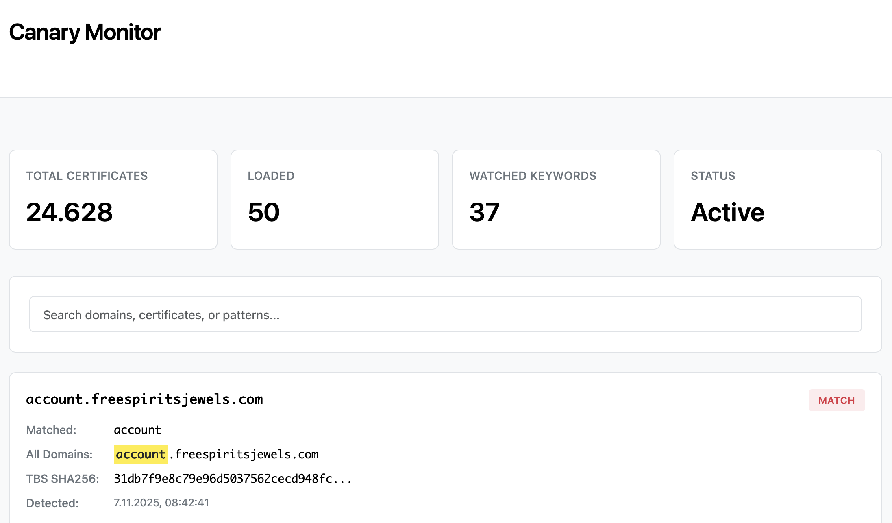
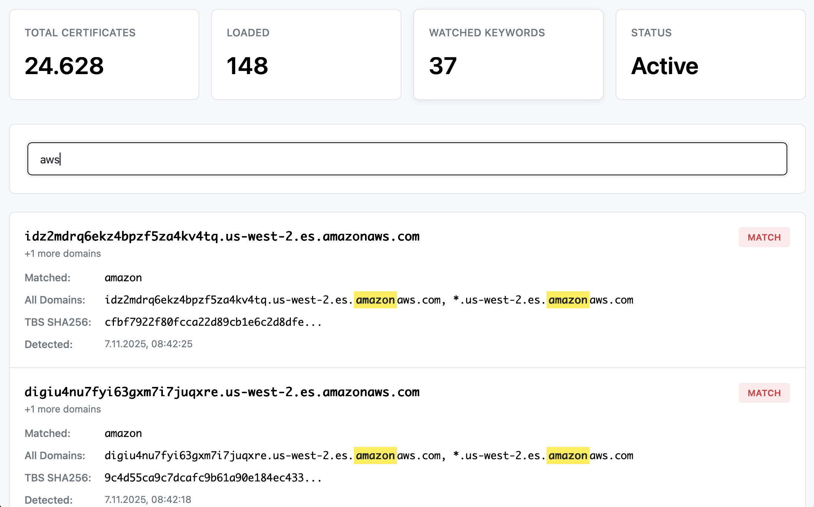

<div align="center">
  
</div>

# Canary - Certificate Transparency Monitor

Real-time phishing detection through Certificate Transparency log monitoring. Detect suspicious domains as certificates are issued.

## Purpose

Canary monitors Certificate Transparency (CT) logs to identify potentially malicious domains in real-time. When a certificate is issued for a domain matching your watchlist (e.g., "paypal", "amazon", "stripe"), Canary immediately alerts you.

**Key Features:**
- **Real-time Detection** - Catch phishing domains as certificates are issued
- **High Performance** - Aho-Corasick algorithm enables efficient multi-keyword matching (O(n+m) vs O(n*k) with regex)
- **Scalable** - Monitor thousands of keywords simultaneously
- **Production Ready** - Complete Docker setup with Certspotter integration
- **Web Dashboard** - Clean, searchable UI for viewing matches
- **REST API** - Full API with OpenAPI documentation

**Use Cases:**
- Brand protection and phishing detection
- Security monitoring for corporate domains
- Research on certificate issuance patterns
- Real-time threat intelligence gathering

## Quick Start

### Option 1: Docker (Recommended)

Complete production-ready setup with automatic CT log monitoring:

```bash
cd deployments/docker
docker-compose up -d --build
```

**What this includes:**
- Canary service with REST API (port 8080)
- Certspotter monitoring 40+ Certificate Transparency logs
- Automatic certificate processing and matching
- SQLite database with partitioned storage
- Web dashboard at http://localhost:8080
- API documentation at http://localhost:8080/docs

**Access the services:**
```bash
# Web Dashboard
open http://localhost:8080

# API Documentation
open http://localhost:8080/docs

# Check health
curl http://localhost:8080/health

# View matches
curl http://localhost:8080/matches/recent?minutes=1440 | jq
```

### Option 2: Local Development

```bash
# Build
go build -o canary ./cmd/canary

# Configure keywords
vim data/keywords.txt

# Run
./canary
```

Service runs on port 8080 (override with `PORT=3000`).

## Deployment

### Docker Deployment

The Docker setup includes both Canary and Certspotter for complete CT log monitoring:

```bash
cd deployments/docker
docker-compose up -d --build
```

**Configuration:**
- Edit `data/keywords.txt` to customize watchlist
- Reload keywords: `curl -X POST http://localhost:8080/keywords/reload`
- View logs: `docker-compose logs -f`
- Stop services: `docker-compose down`

**Files included:**
- `deployments/docker/docker-compose.yml` - Service orchestration
- `deployments/docker/Dockerfile` - Canary container
- `deployments/docker/Dockerfile.certspotter` - Certspotter monitor
- `scripts/certspotter-loop.sh` - Continuous monitoring wrapper
- `scripts/certspotter-docker-webhook.sh` - Certificate forwarding to Canary
- `scripts/watchlist.txt` - Domain patterns for Certspotter

See `deployments/docker/README.md` for detailed documentation.

### Systemd Service

For production Linux servers:

```bash
# Build binary
CGO_ENABLED=1 go build -o canary ./cmd/canary

# Create service user
sudo useradd -r -s /bin/false canary

# Install
sudo mkdir -p /opt/canary/data /opt/canary/web
sudo cp canary /opt/canary/
sudo cp -r data/* /opt/canary/data/
sudo cp -r web/* /opt/canary/web/
sudo chown -R canary:canary /opt/canary

# Setup systemd
sudo cp deployments/canary.service /etc/systemd/system/
sudo systemctl daemon-reload
sudo systemctl enable canary
sudo systemctl start canary
```

**Manage the service:**
```bash
sudo systemctl status canary
sudo systemctl restart canary
journalctl -u canary -f
```

### Cloud Deployment

**Environment Variables:**
- `PORT` - HTTP port (default: 8080)
- `DEBUG` - Enable debug logging (default: false)

**Requirements:**
- SQLite support (CGO required for builds)
- Persistent volume for `/app/data` directory
- Outbound HTTPS for Certspotter CT log access

## API

Canary provides a complete REST API for certificate monitoring and keyword management.

### Documentation

**Interactive API Documentation:** http://localhost:8080/docs

Full OpenAPI 3.0 specification with interactive ReDoc interface.

### Core Endpoints

#### `POST /hook`
Receive Certspotter webhook events (certificate discoveries).

```bash
curl -X POST http://localhost:8080/hook \
  -H "Content-Type: application/json" \
  -d '{
    "id": "cert-abc123",
    "issuance": {
      "dns_names": ["paypal-secure.com", "login.paypal-secure.com"],
      "tbs_sha256": "abc123...",
      "cert_sha256": "def456..."
    }
  }'
```

#### `GET /matches`
Get real-time matches from memory (since server start).

```bash
curl http://localhost:8080/matches | jq
```

#### `GET /matches/recent?minutes=1440&limit=50&offset=0`
Query historical matches from database with optional pagination.

**Parameters:**
- `minutes` - Time window to query (default: 5)
- `limit` - Results per page (default: 50)
- `offset` - Results to skip (default: 0)

```bash
# Last 24 hours (all results)
curl "http://localhost:8080/matches/recent?minutes=1440" | jq

# Last hour with pagination (50 per page)
curl "http://localhost:8080/matches/recent?minutes=60&limit=50&offset=0" | jq

# Next page
curl "http://localhost:8080/matches/recent?minutes=60&limit=50&offset=50" | jq
```

**Response Format (with pagination):**
```json
{
  "count": 50,
  "total": 24733,
  "limit": 50,
  "offset": 0,
  "has_more": true,
  "matches": [
    {
      "dns_names": ["paypal-secure.com", "*.paypal-secure.com"],
      "matched_domains": ["paypal"],
      "tbs_sha256": "abc123...",
      "cert_sha256": "def456...",
      "detected_at": "2025-11-07T10:30:00Z"
    }
  ]
}
```

**Response Format (without pagination):**
```json
{
  "count": 150,
  "matches": [...]
}
```

#### `POST /keywords`
Add new keywords to watchlist.

```bash
curl -X POST http://localhost:8080/keywords \
  -H "Content-Type: application/json" \
  -d '{"keywords": ["amazon", "microsoft", "stripe"]}'
```

#### `POST /keywords/reload`
Reload keywords from file without restart.

```bash
curl -X POST http://localhost:8080/keywords/reload
```

#### `GET /metrics`
System metrics and statistics.

```bash
curl http://localhost:8080/metrics | jq
```

**Response:**
```json
{
  "queue_len": 0,
  "total_matches": 42,
  "total_certificates_checked": 1500,
  "watched_domains": 37,
  "uptime_seconds": 3600,
  "recent_matches": 10
}
```

#### `GET /health`
Health check endpoint.

```bash
curl http://localhost:8080/health
```

Returns `200 OK` if healthy, `503 Service Unavailable` if unhealthy (database or matcher issues).

### CORS

CORS is enabled for all origins to support browser-based clients and direct file access.

## Web UI

Canary includes a clean, responsive web dashboard for viewing and searching matches.

### Features

- **Real-time Stats** - Total matches, certificates checked, watched domains
- **Infinite Scroll** - Automatically loads more matches as you scroll (50 per page)
- **Keyword Highlighting** - Matched keywords highlighted in yellow in domain names
- **Search** - Filter by domain names, keywords, or certificate hashes
- **Auto-refresh** - Metrics update every 30 seconds automatically
- **Responsive Design** - Clean black & white theme, mobile-friendly
- **Time Range** - Shows last 24 hours by default

### Access

**Local:** http://localhost:8080
**Docker:** http://localhost:8080

### Screenshots

The UI displays:
- Stats dashboard showing:
  - Total Certificates: Unique certificates in database (last 24h)
  - Loaded: How many certificates currently loaded in browser
  - Watched Keywords: Number of keywords being monitored
  - Status: Active, Loading, or Complete (metrics auto-refresh every 30s)
- Search bar for instant filtering
- Match cards with DNS names, matched keywords, certificate hashes, timestamps
- Keyword highlighting in yellow for easy identification
- Infinite scroll pagination for smooth browsing (50 per page)

<div align="center">
  
  <p><em>Web Dashboard - Main View</em></p>

  
  <p><em>Match Details with Keyword Highlighting</em></p>
</div>

## Usage

### Keyword Configuration

Edit `data/keywords.txt` with brands/terms to monitor (one per line):

```
paypal
stripe
amazon
microsoft
banking
login
secure
```

**Best Practices:**
- Use lowercase keywords
- Focus on high-value brands
- Include common typosquatting targets
- Reload after changes: `curl -X POST http://localhost:8080/keywords/reload`

### Monitoring Workflow

1. **Setup** - Deploy with Docker or systemd
2. **Configure** - Add keywords to `data/keywords.txt`
3. **Monitor** - View matches in web UI or query API
4. **Investigate** - Check suspicious certificates
5. **Alert** - Integrate with your security tools

### Integration Examples

**Slack Webhook:**
```bash
curl http://localhost:8080/matches/recent?minutes=5 | \
  jq '.matches[] | "New cert: \(.dns_names | join(", "))"' | \
  xargs -I {} curl -X POST https://hooks.slack.com/services/YOUR/WEBHOOK/URL \
    -d '{"text": "{}"}'
```

**Email Alert:**
```bash
#!/bin/bash
MATCHES=$(curl -s http://localhost:8080/matches/recent?minutes=60)
COUNT=$(echo "$MATCHES" | jq '.count')

if [ "$COUNT" -gt 0 ]; then
  echo "$MATCHES" | jq -r '.matches[] | .dns_names | join(", ")' | \
    mail -s "Canary Alert: $COUNT new matches" security@company.com
fi
```

**Continuous Monitoring:**
```bash
# Run every 5 minutes via cron
*/5 * * * * /usr/local/bin/check-canary.sh
```

### Database Queries

Direct SQLite queries for advanced analysis:

```bash
# Total matches by keyword
sqlite3 data/matches.db \
  "SELECT keyword, COUNT(*) as count FROM matches_p GROUP BY keyword ORDER BY count DESC"

# Recent matches for specific keyword
sqlite3 data/matches.db \
  "SELECT domains, tbs_sha256 FROM matches_p WHERE keyword='paypal' LIMIT 10"

# Certificates with multiple keywords
sqlite3 data/matches.db \
  "SELECT cert_id, COUNT(DISTINCT keyword) as keywords FROM matches_p GROUP BY cert_id HAVING keywords > 1"
```

### Certspotter Integration

Canary receives certificates from Certspotter via webhooks.

**Self-Hosted Certspotter:**
```bash
export CANARY_ENDPOINT='http://localhost:8080/hook'
certspotter -watchlist <(echo .) -script scripts/certspotter-webhook.sh
```

**Certspotter Cloud Service:**
1. Sign up at https://sslmate.com/certspotter/
2. Add webhook: `https://your-domain.com/hook`
3. Done - certificates forwarded automatically

**Docker (Included):**
Certspotter runs automatically in the docker-compose setup.

## How It Works

1. **Certspotter** monitors 40+ Certificate Transparency logs
2. **Discovery** - New certificates detected in real-time
3. **Webhook** - Certspotter sends certificate data to `/hook`
4. **Matching** - Aho-Corasick algorithm matches domains against keywords in O(n+m) time
5. **Storage** - Matches stored in SQLite with partitioned tables (by keyword first letter)
6. **Query** - Access via REST API or web dashboard

**Performance:**
- Processes thousands of certificates per second
- Sub-millisecond keyword matching
- Minimal memory footprint
- Scales to 10,000+ keywords

## Troubleshooting

**API connection errors:**
- Check service is running: `curl http://localhost:8080/health`
- Verify CORS headers present: `curl -I http://localhost:8080/matches`
- Check logs: `docker-compose logs canary` or `journalctl -u canary -f`

**No matches appearing:**
- Verify keywords loaded: `curl http://localhost:8080/metrics`
- Check Certspotter is running: `docker-compose ps`
- Inspect Certspotter logs: `docker-compose logs certspotter`
- Test webhook manually: `curl -X POST http://localhost:8080/hook -d @test.json`

**Database issues:**
- Check database file exists: `ls -lh data/matches.db`
- Verify write permissions: `ls -ld data/`
- Check disk space: `df -h`

**Performance:**
- Monitor queue length: `curl http://localhost:8080/metrics | jq .queue_len`
- Increase workers if queue grows: Edit `database.StartWorkers()` in `cmd/canary/main.go`
- Check CPU usage: `docker stats` or `top`

## Development

**Build:**
```bash
go build -o canary ./cmd/canary
```

**Test:**
```bash
go test ./...
```

**Dependencies:**
```bash
go mod download
```

**Requirements:**
- Go 1.21+
- CGO enabled (for SQLite)
- GCC/musl-dev (for compilation)

## License

For authorized security research and defensive purposes only.
